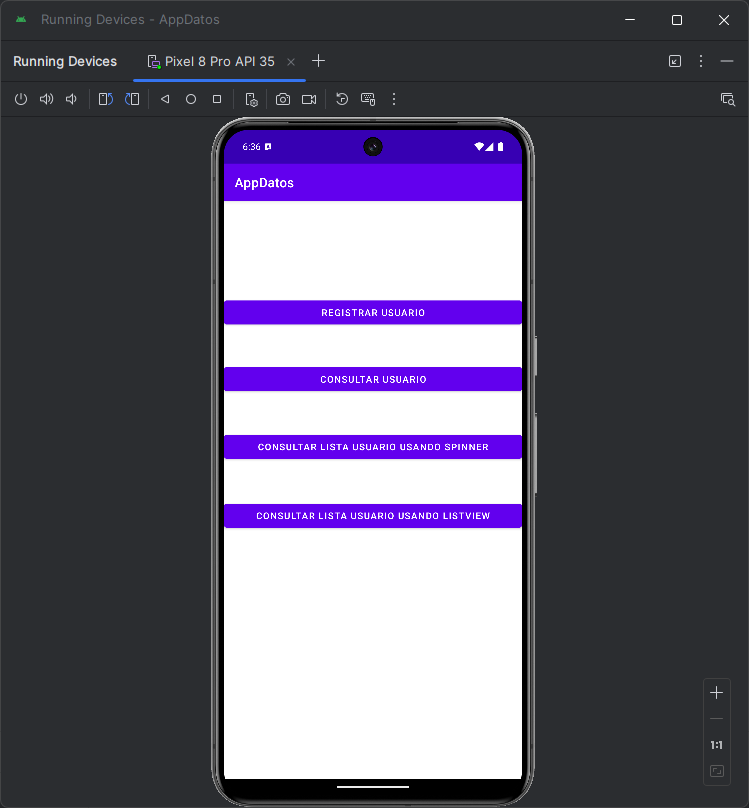

# 🧮 Proyecto - UsoSqliteCRUD (AppDatos)

Este proyecto es una aplicación móvil desarrollada en Android Studio con Java, que implementa una base de datos local usando SQLite. Su objetivo es mostrar el funcionamiento básico de un sistema CRUD (Crear, Leer, Actualizar y Eliminar datos), ideal como práctica para quienes están aprendiendo a manejar bases de datos en Android.

Características :

- Registro de datos en base de datos SQLite.
- Listado de registros almacenados.
- Actualización de registros existentes.
- Eliminación de registros.
- Interfaz sencilla y funcional.
- Sin necesidad de conexión a internet.

---

## 📷 Captura del Programa



---

## 🛠 Tecnologías usadas

- Java – Lenguaje de programación principal.
- Android Studio – Entorno de desarrollo.
- SQLite – Motor de base de datos local.
- XML – Diseño de interfaces.

---

## 🚀 Cómo ejecutar

1. Clona o descarga este repositorio.
   ```bash
   git clone https://github.com/INGCAMB/UsoSqliteCRUD.git
3. Abre el proyecto en Android Studio.
4. Conecta un dispositivo Android o inicia un emulador.
5. Haz clic en Run (▶️) para compilar y ejecutar la app.
6. Interactúa con la app ingresando, editando o eliminando datos.

---

## ✍️ Autor

- Carlos Alberto Medina Beltran
